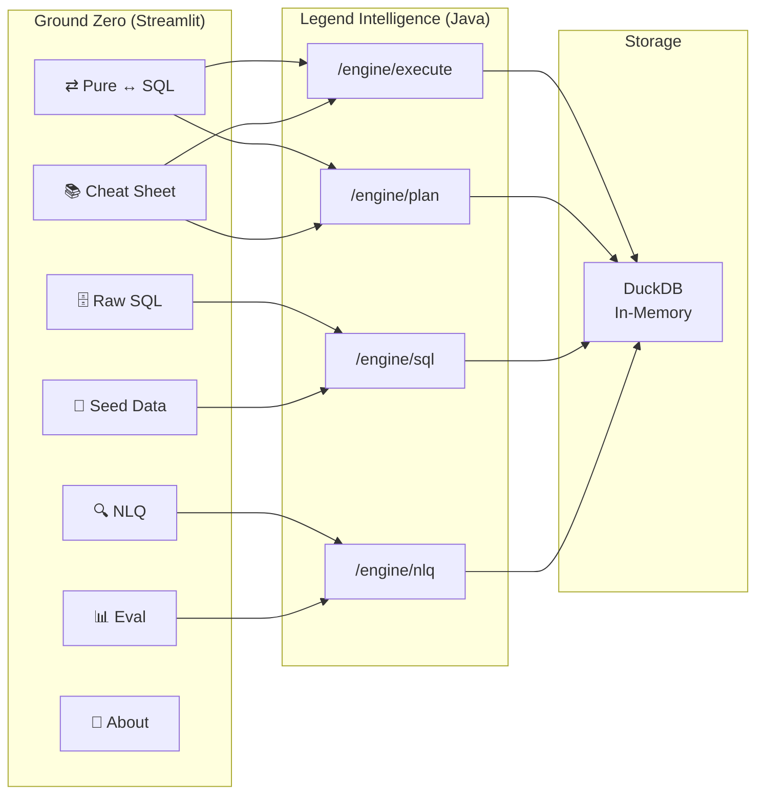
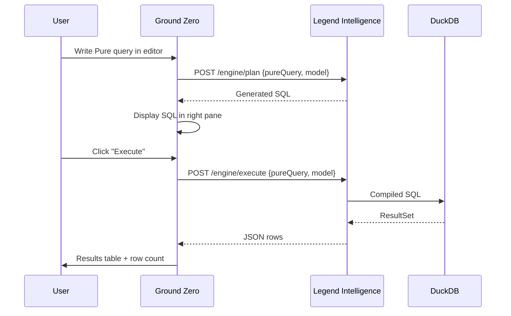
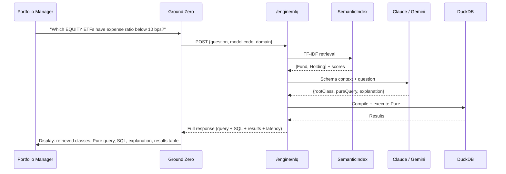

# Legend Ground Zero

### Mission control for institutional data — write Pure, see SQL, ask in English, validate with eval. One Streamlit app, zero friction.

Legend Ground Zero is the **front door** to the Legend stack. Point it at a running [legend-intelligence](https://github.com/absnarang/legend-intelligence) backend and get a bidirectional Pure ↔ SQL editor, a natural language query interface, a 36-example interactive cheat sheet, and a scoring eval framework — all in a single browser tab.

> **7 tabs · 2 domain models · 36 cheat sheet examples · 59 eval cases · 9 scoring dimensions**

---

## What Problem Does This Solve?

| Today | With Ground Zero |
|-------|-----------------|
| Learning Pure means reading spec docs and hoping your syntax is right | 36 runnable examples with generated SQL and line-by-line explanations |
| NLQ demos require a notebook, API keys, and manual inspection | Type a question → see retrieved classes, generated Pure, SQL, and results in one screen |
| LLM hallucinates answers to unanswerable questions | Graceful decline with follow-up questions when a question is outside the model's scope |
| Validating NLQ accuracy means eyeballing a handful of queries | 59-case eval framework scores retrieval, accuracy, LLM faithfulness, and follow-up quality automatically |
| Translating between Pure and SQL requires running two separate tools | Bidirectional editor: Pure → SQL via compiler, SQL → Pure via Claude |
| Onboarding to a new data model takes days of meetings | Seed data loads in one click, example queries demonstrate every operation |
| Understanding what the compiler actually generates requires reading logs | Every query shows the exact SQL that reaches DuckDB |

---

## Architecture



---

## Pure Query Execution



---

## NLQ Pipeline (Visible End-to-End)



---

## Key Concepts

### :telescope: Seven Tabs, One Workflow

| Tab | Icon | What It Does | Audience |
|-----|------|-------------|----------|
| **Pure ↔ SQL** | ⇄ | Bidirectional editor — write Pure, see SQL; write SQL, get Pure back | Engineers, Analysts |
| **Raw SQL** | 🗄️ | Execute raw SQL against the seeded DuckDB store | Data Engineers |
| **Seed Data** | 🌱 | Load ETF or Northwind seed data into in-memory tables | Everyone (setup) |
| **NLQ** | 🔍 | Natural language → Pure → SQL → results pipeline (with graceful decline for unanswerable questions) | PMs, Desk Strategists |
| **Cheat Sheet** | 📚 | 36 runnable Pure examples with full documentation | New users, Onboarding |
| **Eval** | 📊 | Score NLQ accuracy across 59 cases with 9 dimensions (including follow-up rate & usefulness) | NLQ developers |
| **About** | 📖 | Pure syntax reference and association model docs | Reference |

### :left_right_arrow: Bidirectional Pure ↔ SQL Translation

The Pure ↔ SQL tab is a dual-pane editor:

- **Pure → SQL** — sends your Pure query to the Legend Intelligence compiler, shows the exact generated SQL
- **SQL → Pure** — sends your SQL to Claude, which translates it back to idiomatic Pure
- **Execute** — runs the Pure query end-to-end and displays results as a table

This lets you learn Pure by writing SQL you already know, or verify what the compiler generates by reading the SQL output.

### :books: Cheat Sheet — 36 Interactive Examples

Every Pure TDS operation demonstrated on the Northwind dataset, organized by category:

| Category | Examples | Operations Covered |
|----------|----------|-------------------|
| **Basics** | 2 | `project`, `filter` |
| **Slicing** | 3 | `take`, `skip`, `drop` |
| **Column Manipulation** | 3 | `rename`, `select` |
| **Joins** | 4 | Navigation joins (1-hop, multi-hop), explicit `join` (INNER, LEFT) |
| **GroupBy** | 3 | `groupBy` with count, sum, avg, HAVING pattern |
| **Set Operations** | 2 | `concatenate` (UNION ALL) |
| **Window Functions** | 3 | `rank`, `lag`, `lead` |
| **Window** | 2 | `rowNumber`, `ntile`, `percentRank`, `cumulativeDistribution` |
| **Extend** | 2 | Calculated columns |
| **Variant / Flatten** | 2 | `flatten` — reference syntax |
| **AsOf Join** | 2 | `asOfJoin` with equality + time condition |

Each entry shows:
- The **Pure query** — runnable against the live engine
- The **generated SQL** — what the compiler actually produces
- A **"How it works"** expander — function signature, arguments by name and type, SQL equivalent, behavioral notes

### :mag: NLQ — Ask Your Data in English

Select a domain model (ETF or Northwind), pick a Claude model, type a question:

```
What are the top 5 holdings of SPY by weight?
Which EQUITY ETFs have expense ratio below 0.1%?
Show me all TECHNOLOGY stocks with market cap above 2 trillion
What was the average NAV of QQQ in January 2024?
Which funds hold AAPL and what is its total weight across all ETFs?
Show all products in the Beverages category sorted by price descending
Which employees made the most sales by total order value?
```

The NLQ tab shows the full pipeline output: retrieved classes with scores, generated Pure query, compiled SQL, LLM explanation, and results table.

When a question can't be answered — wrong domain, ambiguous, missing context, or requiring unsupported computation — the pipeline **gracefully declines** and suggests a specific follow-up question instead of hallucinating a query.

### :chart_with_upwards_trend: Eval Framework — 9 Scoring Dimensions

The Eval tab runs NLQ end-to-end against 59 test cases (26 Northwind + 27 ETF + 6 decline) and scores each response:

**Normal cases (47):**

| Dimension | Weight | What It Measures |
|-----------|--------|-----------------|
| **Retrieval Recall** | 20% | Did the pipeline retrieve all required classes? |
| **Query Precision** | 10% | Does the generated Pure query reference only the classes it needs? 1.0 = no unnecessary class references |
| **Answer Accuracy** | 20% | Column overlap (60%) + row count similarity (40%) vs. reference |
| **Ops Coverage** | 10% | Fraction of required Pure operations in generated query |
| **Completeness** | 15% | LLM judge: does the query capture all requested data elements? |
| **Faithfulness** | 10% | LLM judge: is the query logically accurate, no hallucinations? |
| **Relevance** | 15% | LLM judge: do results actually answer the user's question? |

Retrieval Precision (F1-style TF-IDF score) is still tracked as a diagnostic metric in the per-case table but removed from the overall score — it was structurally capped at ~0.33–0.50 on small models regardless of query quality.

**Decline cases (12):**

When the NLQ pipeline encounters a question it cannot answer — wrong domain, ambiguous, missing context, or requiring unsupported computation — it should **decline gracefully** and suggest a follow-up question instead of hallucinating a query.

| Dimension | Weight | What It Measures | Target |
|-----------|--------|-----------------|--------|
| **Follow-up Rate** | 60% | Did the system correctly decline and trigger a follow-up question? A false positive (generating a query for an unanswerable question) scores 0. | 85% |
| **Follow-up Usefulness** | 40% | How specific and actionable was the suggested follow-up question? Scored by an LLM judge (1-5 scale). A generic "Could you clarify?" scores low; a precise "Which fund's holdings are you interested in?" scores high. | 4.25/5 |

Decline categories tested: wrong domain, missing info, ambiguous, unsupported computation.

**Pass threshold:** weighted composite > 0.6

---

## Domain Models

### ETF / Mutual Fund

| Class | Stereotype | Key Properties | Role |
|-------|-----------|---------------|------|
| `etf::Fund` | `core` | ticker, fundName, aum, assetClass, sector, expenseRatio, benchmarkIndex | Investment vehicle |
| `etf::Security` | `core` | ticker, companyName, sector, country, marketCap | Underlying stock/bond |
| `etf::Holding` | `junction` | weight, shares, marketValue | Fund → Security bridge |
| `etf::NAVRecord` | `timeseries` | navDate, nav, volume | Daily price snapshots |

**Associations:** Fund ↔ Holding, Security ↔ Holding, Fund ↔ NAVRecord
**Seed data:** 5 funds (SPY, QQQ, VTI, AGG, GLD) · 10 securities · 22 holdings · 19 NAV records

### Northwind (Relational)

| Class | Stereotype | Key Properties | Role |
|-------|-----------|---------------|------|
| `northwind::model::Category` | `core` | categoryName, description | Product classification |
| `northwind::model::Supplier` | `core` | companyName, country, city | Product source |
| `northwind::model::Product` | `core` | productName, unitPrice, unitsInStock, discontinued | Catalog item |
| `northwind::model::Customer` | `core` | companyName, contactName, city, country | Buyer |
| `northwind::model::Employee` | `core` | firstName, lastName, title, hireDate | Sales rep |
| `northwind::model::Order` | `core` | orderDate, freight, shipCountry | Transaction header |
| `northwind::model::OrderDetail` | `junction` | unitPrice, quantity, discount | Line-item bridge |

**Associations:** Category ↔ Product, Supplier ↔ Product, Customer ↔ Order, Employee ↔ Order, Order ↔ OrderDetail, OrderDetail ↔ Product
**Seed data:** 8 categories · 5 suppliers · ~15 products · ~6 customers · 9 employees · ~830 orders · ~2,150 order details

---

## Quick Start

```bash
# 1. Start the legend-intelligence backend (port 8080)
#    See: https://github.com/absnarang/legend-intelligence
cd legend-intelligence && mvn package -DskipTests -q && ./start-nlq.sh &

# 2. Install Python dependencies
pip install streamlit requests pandas

# 3. Run the workbench
streamlit run playground.py

# 4. Open http://localhost:8501 in your browser

# 5. Click "Seed Data" tab → load ETF or Northwind data → start querying
```

---

## Example Queries

| Question | Domain | Difficulty | Key Operations |
|----------|--------|-----------|---------------|
| What are the top 5 holdings of SPY by weight? | ETF | Medium | Navigation join, filter, sort, limit |
| Which EQUITY ETFs have expense ratio below 0.1%? | ETF | Easy | Filter with enum + numeric comparison |
| Total AUM by asset class | ETF | Medium | GroupBy, sum aggregation |
| Show all products in the Beverages category sorted by price | Northwind | Easy | Navigation join, filter, sort |
| Which employees made the most sales by total order value? | Northwind | Hard | Multi-hop join, groupBy, arithmetic |
| Average freight by ship country for orders above $50 | Northwind | Medium | Filter, groupBy, avg aggregation |
| Rank funds by AUM within each asset class | ETF | Hard | Window function (rank), partition |
| What is AAPL's total weight across all ETFs? | ETF | Medium | Filter, groupBy, sum, navigation join |

---

## Why This Matters for S&T

**Instant feedback loop** — Write a Pure query, see the SQL, execute it, iterate. No build step, no deployment, no waiting. The compile-execute cycle is under a second.

**NLQ validation** — Don't just demo NLQ to stakeholders. Run 59 eval cases, get recall/query precision/accuracy scores, prove the pipeline works before shipping to production.

**Onboarding** — New team members can learn Pure through 36 runnable examples instead of reading spec docs. Each example shows Pure, SQL, and a detailed explanation.

**Bidirectional translation** — Know SQL? Write it in the right pane and get Pure back. Know Pure? See exactly what SQL the compiler generates. The translation is transparent, not a black box.

---

## Testing and Quality

| Metric | Value |
|--------|-------|
| Cheat sheet tests | 36 parametrized (54 assertions, 1 skipped) |
| Eval test cases | 59 (23 Northwind + 24 ETF + 12 decline) |
| Scoring unit tests | Coverage for all 9 dimensions |
| Baseline — full pipeline | Query Precision ~0.90, Recall 1.00, Pass 100% |

```bash
# Backend must be running on port 8080 first
pip install pytest requests
pytest tests/test_northwind_cheatsheet.py -v
# Expected: 54 passed, 1 skipped
```

---

## File Map

```
legend-groundzero/
├── playground.py              # Streamlit workbench (1,501 lines — 7 tabs)
├── etf_data.py                # ETF model, seed SQL, 9 example questions (371 lines)
├── northwind_data.py          # Northwind model, seed SQL, 36 cheat sheet examples (1,649 lines)
├── nlq_eval.py                # Eval scoring framework — 9 dimensions (540+ lines)
├── eval_cases.json            # 59 eval test cases (23 Northwind + 24 ETF + 12 decline)
├── tests/
│   ├── test_northwind_cheatsheet.py  # 36 parametrized cheat sheet tests
│   └── test_nlq_eval.py             # Scoring function unit tests
├── legend-intelligence/        # Legend Intelligence engine (separate repo)
└── .env                       # LLM provider config
```

---

## :warning: Disclaimer

> **All data, names, and figures in this application are entirely fictional and used for educational and illustrative purposes only.**

- **Company names, fund names, and ticker symbols** (e.g. SPY, QQQ, VTI, AAPL, MSFT, NVDA, AMZN, GOOGL) appear as recognisable placeholders to make example queries readable. They do not represent real funds or securities, and no data associated with them reflects any actual market value, performance, or characteristic.

- **Financial metrics** — AUM, market capitalisation, NAV, expense ratio, portfolio weights, share counts, volumes, and prices — are randomly chosen dummy values with no relation to real market data, past or present.

- **Enumerations, asset classes, and sector labels** (EQUITY, FIXED_INCOME, COMMODITY, TECHNOLOGY, HEALTHCARE, FINANCIALS, etc.) are generic illustrative examples produced by frontier AI models. They carry no endorsement of, or affiliation with, any real index provider, fund manager, asset manager, or financial institution.

- **Benchmark index names** (e.g. "S&P 500", "NASDAQ-100") appear as illustrative string values in dummy data only. No affiliation with or endorsement by the index providers (S&P Global, Nasdaq, Inc.) is claimed or implied.

- This application does **not** constitute financial advice, investment recommendations, or solicitation of any kind.

- No trademark, copyright, patent, or other intellectual property of any third party is claimed or implied by this project.

*This repository exists solely to demonstrate the Pure language engine, SQL compilation pipeline, and LLM-powered Natural Language Query capabilities described in [legend-intelligence](https://github.com/absnarang/legend-intelligence).*

---

## Related

- [legend-intelligence](https://github.com/absnarang/legend-intelligence) — The Pure language compiler, SQL execution engine, and NLQ pipeline (Java backend)
